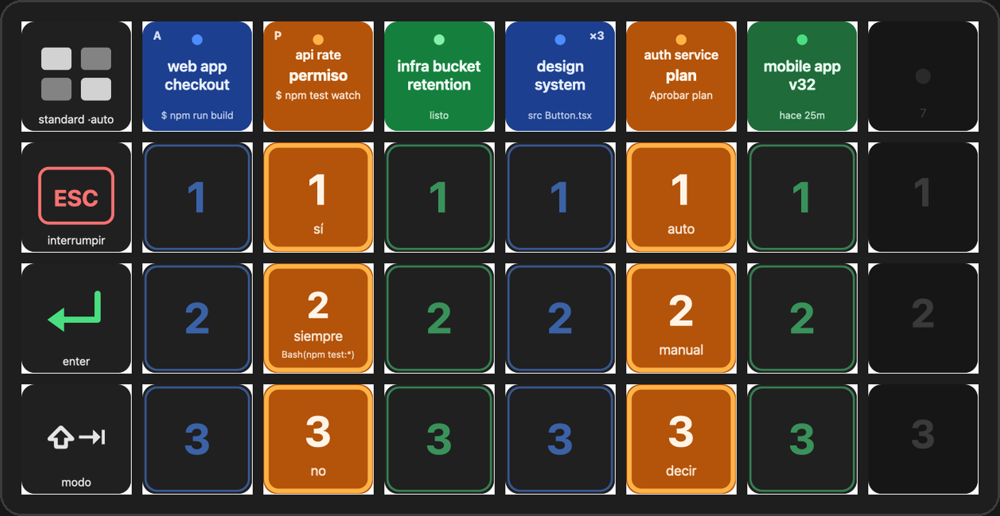
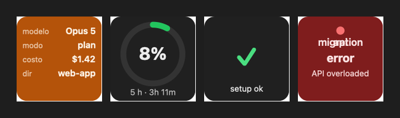

# Claude iTerm Deck

Drive your [Claude Code](https://claude.com/claude-code) sessions in iTerm2 from an Elgato Stream Deck:
one key per iTerm tab showing what Claude is doing, and keys that answer its prompts **in the right
session, without switching tabs**.



*[Versión en español más abajo.](#español)*

## What it does

- **One column per iTerm tab running Claude Code**, in iTerm's tab order. The session key shows the
  session name, its state (blue = working, orange = waiting for you, green = idle / "done", red = error),
  the current tool (`$ npm test`, `Header.tsx`), the permission mode (`P` plan, `A` acceptEdits…) and
  how many subagents are running (`×3`).
- **When Claude asks something** the key tells you *what* (a permission for `$ npm test`, plan approval,
  a question), the column blinks, and the **1 / 2 / 3 keys** below answer it: `yes / always / no` for
  permissions, `auto / manual / tell` for plans, `option 1/2/3` for questions. Key 2 even shows the
  rule Claude suggests (`Bash(npm test:*)`). Answers go to that session via iTerm's API; your focus
  stays where it is.
- **Tap a session key** to jump to that pane. Hold 0.5 s to clear a stuck state; hold 3 s to send Esc.
- **Global keys**: Esc (interrupt), Enter, Shift+Tab (cycle permission mode), a **Setup** key that
  diagnoses the install (and installs the hook on tap), and a **Usage** key with your 5-hour / 7-day
  limits.
- **Views that adapt to how many sessions you run**: *Focus* (1–3 sessions, two columns each with
  model / mode / cost), *Standard* (4–7) and *Dense* (8–14, answers act on the selected session).
  The plugin switches automatically; the *view* key switches by hand. Profiles for Mini, MK.2, Neo
  and + are generated too (untested on hardware).



## How it works

| Source | Used for |
|---|---|
| `~/.claude/sessions/<pid>.json` — written by Claude Code itself | busy/idle status and session name without any hook |
| `ps` — `claude` processes per tty | which iTerm sessions actually run Claude, so a key never outlives its session |
| `it2` — the CLI bundled with iTerm2 ≥ 3.7 | list sessions/tabs, focus a pane, send keystrokes to a specific session |
| `hooks/claude-deck-status` — a Claude Code hook | *waiting* states with detail: which tool, which file, which question; permission mode, model, subagents, errors |

The hook writes one small JSON per session to `~/.local/state/claude-deck/sessions/`; the plugin
watches that directory and re-derives the key layout in [`plugin/src/logic.ts`](plugin/src/logic.ts)
(pure, unit-tested). No HTTP servers, no ports, no Accessibility permission.

## Requirements

- macOS, **iTerm2 ≥ 3.7** with the Python API enabled (Settings → General → Magic), Stream Deck app ≥ 7.1.
- Claude Code (any recent version), `jq` (`brew install jq`).
- For building: Node ≥ 24.

## Install

**From a release** — download `com.pabloalaniz.claude-iterm-deck.streamDeckPlugin`, double-click it,
add the *Claude iTerm Deck* profile (or just place the actions on any page) and tap **Setup**: it
registers the hook in `~/.claude/settings.json` (a backup is made). Restart your Claude Code sessions
so they pick up the hook — sessions started earlier still show up, they just get less detail.

**From source**

```bash
git clone https://github.com/PabloAlaniz/claude-iterm-deck && cd claude-iterm-deck
hooks/install.sh                      # registers the hook (reversible: hooks/install.sh --uninstall)
cd plugin && nvm use 24 && npm install
npm run build && npm run profiles && npm run hooks
npx streamdeck dev                    # once: enables developer mode
npx streamdeck link com.pabloalaniz.claude-iterm-deck.sdPlugin
npx streamdeck restart com.pabloalaniz.claude-iterm-deck
```

First run: macOS asks to let **Elgato Stream Deck** control **iTerm2** (Automation) → allow. iTerm2
shows a banner asking to authorize *Claude iTerm Deck* for a reusable API cookie → pick a long
duration (or ignore it: the plugin falls back to a single-use cookie per call). The Usage key reads
the Claude Code OAuth token from your keychain (read-only); macOS may ask once.

## Keys

| Key | Action |
|---|---|
| Session N | Tap: focus that pane. Hold 0.5 s: clear the hook state. Hold 3 s: Esc to that session. |
| 1 / 2 / 3 | Send that digit to the session (answers permission, plan and question prompts). |
| Esc / Enter | To the active iTerm session, or to a fixed / selected session (property inspector). |
| ⇧⇥ mode | Shift+Tab to the active session (cycles Claude's permission mode). |
| Info | Model, mode, subagents, API-equivalent cost of the session (from the transcript), folder. |
| View | Shows the current view; tap to cycle Focus → Standard → Dense (pauses auto-switch 10 min). |
| Setup | Checks hooks, `jq`, `it2`, Automation permission, iTerm API, running sessions. Tap to install the hook. |
| Usage | 5-hour window with countdown; tap for the 7-day window. |
| ◀ / ▶ | Previous / next iTerm tab (available action, not in the default profiles). |

Deep links for scripts: `open "streamdeck://plugins/message/com.pabloalaniz.claude-iterm-deck/switch/dense"`
(`switch/<focus|standard|dense>`, `select/<n>`, `refresh`).

## Development

```bash
cd plugin
npm run watch            # rebuild + restart on change
npm test                 # logic (node:test) + hook (bash fixtures)
npm run pack             # dist/*.streamDeckPlugin
../scripts/simulate.sh demo   # fake states on the deck; `clear` to restore
tail -f com.pabloalaniz.claude-iterm-deck.sdPlugin/logs/*.log
```

`applescripts/` has standalone `.scpt` scripts (go to iTerm, Cmd+1..9, send 1/2/3, Esc, Enter, Shift+Tab,
prev/next tab) for any launcher; build them with `applescripts/build.sh`.

See [`docs/prior-art.md`](docs/prior-art.md) for the other Stream Deck + Claude Code plugins, what
this project borrowed from each, and where its design differs.

## Troubleshooting

- **No sessions shown**: the Setup key lists what is missing. `ps -axo tty=,comm= | grep claude`
  must list `claude` on `ttysNNN`; `it2 session list` must work from an iTerm shell.
- **`Authentication failed` in the log**: iTerm's Python API is off, or macOS did not grant
  Automation to Stream Deck (System Settings → Privacy & Security → Automation).
- **State does not change**: `cat ~/.local/state/claude-deck/sessions/*.json`; restart the Claude
  session (hooks load at start) and check `jq .hooks ~/.claude/settings.json`.
- **Undo everything**: `hooks/install.sh --uninstall`, `npx streamdeck unlink com.pabloalaniz.claude-iterm-deck`,
  delete the profiles from the Stream Deck app.

## Limits and notes

- macOS + iTerm2 only, by design (`it2` and AppleScript are what make "answer without switching" work).
- Up to 7 tabs in Standard, 14 in Dense; extra tabs are hidden idle-first, the view key shows `+N`.
- The Usage key calls an undocumented endpoint with your Claude Code OAuth token (same one `/usage`
  uses). It may change; when it does, the key shows `--` and nothing else breaks.
- Not affiliated with Anthropic or Elgato.

---

## Español

Controlá tus sesiones de Claude Code en iTerm2 desde el Stream Deck: una tecla por tab que muestra qué
está haciendo Claude, y teclas que responden sus prompts **en la sesión correcta, sin cambiar de tab**.

- **Una columna por tab de iTerm** con Claude Code, en el orden de iTerm. La tecla de sesión muestra
  nombre, estado (azul working, naranja esperando, verde idle/"listo", rojo error), el tool actual,
  el modo de permisos (`P` plan, `A` acceptEdits…) y los subagentes (`×3`).
- **Cuando Claude pregunta**, la tecla dice *qué* (permiso para `$ npm test`, aprobar plan, una
  pregunta), la columna parpadea y las teclas **1 / 2 / 3** responden: `sí / siempre / no` para
  permisos, `auto / manual / decir` para planes, `op. 1/2/3` para preguntas. La tecla 2 muestra la
  regla que Claude sugiere (`Bash(npm test:*)`).
- **Tap en la sesión** = ir a ese pane. 0,5 s = limpiar estado atascado. 3 s = Esc a esa sesión.
- **Globales**: Esc, Enter, Shift+Tab (modo), **Setup** (diagnóstico e instalación del hook) y **Uso**
  (límite de 5 h / 7 d).
- **Vistas** según cuántas sesiones tenés: *Focus* (1–3), *Standard* (4–7), *Dense* (8–14). El plugin
  cambia sola; la tecla *vista* cambia a mano.

Instalación, teclas y troubleshooting: ver arriba (mismos comandos). Otros plugins del nicho, qué se
tomó de cada uno y en qué difiere este diseño: [`docs/prior-art.md`](docs/prior-art.md).
